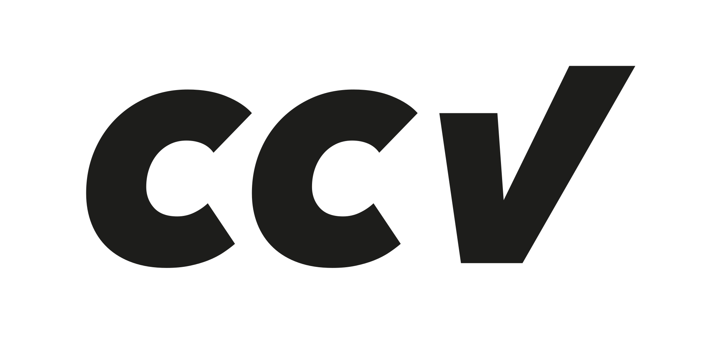
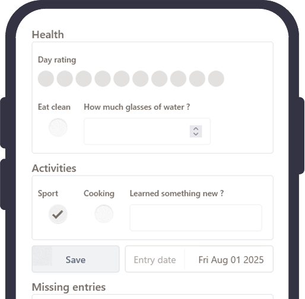

<br />
<div align="center">
  <a href="https://ccv.nikit.app" target="_blank">
    
  </a>

  <p align="center">
    A simple, open-source, data-focused, free and privacy-first habits tracker.
    <br />
    <a href="https://github.com/Nikita-Philippe/CCV"><strong>Explore the docs »</strong></a>
    <br />
    <br />
  </p>
</div>

<div align="center">
    
</div>

---

> [!IMPORTANT]
> CCV is currently in **active** development. Star and watch this repository to get notified of updates.

> [!WARNING]
> Even if thoroughly tested, this project was **not** reviewed by a security expert. CCV decline all liability in case of data loss or breach. Please use at your own risk.

## 🎉 CCV Habits tracker

CCV focuses on your data. Create a habit schema, log entries, get reminders, and track progress without fluff.

- **Create unlimited habits** from a variety of data types (number, boolean, text, multiple choice, etc)
- Log your habits using a **simple and mobile-friendly interface**
- Set up to two daily **reminders** (push, email, optional Discord webhook)
- **Sync** across devices via Google Sign‑In
- **Analyze** progress with configurable dashboards and time ranges
- Manage your data with **import/export** on JSON/CSV
- **Full privacy-first approach**: zero-knowledge architecture, all data encrypted end-to-end

## Getting started

CCV is available for free at [ccv.nikit.app](https://ccv.nikit.app) !

If you prefer a custom installation, you can deploy it yourself by following the instructions below.

> [!TIP]
> Please make sure to have [Deno](https://deno.land/#installation) installed (version 2.5 or higher).

### Self-hosted

> [!WARNING]
> The Docker integration is currently experimental with the new crypto architecture. Please report any issue you may encounter.

[Fresh](https://fresh.deno.dev) allows for easy deployment using [Docker](https://fresh.deno.dev/docs/deployment/docker).

Before starting, make sure to set up the environment variables and the ccv config file. You can copy both example files and modify them as needed:

```sh
cp .env.example .env
cp ccv.example.json ccv.json
```

```sh
# Build the image. BUILD_REVISION is optional, but recommended for version tracking. It can be a git commit hash or tag.
docker build --build-arg BUILD_REVISION=$(git rev-parse --short HEAD) -t ccv-image .

# Run the container
docker run -d --name ccv --restart unless-stopped -p 3000:3000 --env-file .env -v ./db/kv.sqlite3:/data ccv-image
```

### Deno deploy

CCV can be deployed [EA Deno deploy](https://docs.deno.com/deploy/early-access/).

1. [Fork this repository](https://github.com/Nikita-Philippe/ccv/fork) to your own GitHub account.
2. Go to the [Deno deploy dashboard](https://console.deno.com/deploy) and connect your Github account.
3. Create a "New project".
   1. Select your account, and the forked repository.
   2. Click on "edit build config", ans set "Framework preset" to "Fresh" (Is hould have `deno task build` as build command, and `main.ts` as entrypoint).
   3. Click on "Add environment variable" and import your `.env` file.
   4. Click on "Create app".
4. Navigate to "Databases".
   1. "Provision new database", select "Deno KV" and set the name.
   2. Then on your database, "assign" it to your project.
5. Your project should now be deployed!

To update your deployment you can either :

- Push to the main/dev branch. It will respectively deploy on the production/preview environment.
- Deploy using the Deno CLI:

```sh
# First check that the deno.json `deploy` target your current organization/project
DENO_DEPLOY_TOKEN=your_token_generated_in_deploy_user_settings deno task [deploy|deploy-prod]
```

- Manually trigger a redeploy from the Deno deploy dashboard.

### Locally

You can deploy and run CCV locally using [Docker](#self-hosted) or by running it directly with Deno.

```sh
# Run as development server
deno task start

# Or build and run the production server
deno task preview
```

## Roadmap / TODOs

Check the roadmap at [CCV](https://ccv.nikit.app#roadmap).

The [TODOS.md](TODOS.md) file for the current tasks, future features, and known issues.

## Contributing

We absolutely welcome contributions! To contribute, please follow these guidelines:

1. Fork the repository and create your branch from `dev` (ex. `git checkout -b feature/new-feature`).
2. Commit your changes
   - Write clear, concise commit messages. If you have multiple changes, create a muli-line commit message. Il like to use [gitmoji](https://gitmoji.dev/) for my messages.
   - Ensure your code adheres to the existing style and conventions
   - Test your changes thoroughly
3. Push your branch to your forked repository.
4. Open a pull request against the `dev` branch of the main repository.

## Tech stack and notes

[CCV](https://ccv.nikit.app), as its core, is built with:
- [Deno](https://deno.land) - A modern runtime for JavaScript and TypeScript
- [Fresh](https://fresh.deno.dev) - A next-gen web framework for Deno
- [Deno KV](https://deno.land/x/kv) - A distributed key-value database built into Deno
- [Tailwind CSS](https://tailwindcss.com) and [DaisyUI](https://daisyui.com) - Utility-first CSS framework and component library
- [KV-toolbox](https://jsr.io/@kitsonk/kv-toolbox) - A set of utilities and patterns for working with Deno KV
- [Deno KV OAuth](https://jsr.io/@deno/kv-oauth) - OAuth2 integration for Deno KV
---

<a href="https://fresh.deno.dev">
  
</a>

<p align="right">(<a href="#readme-top">back to top</a>)</p>
